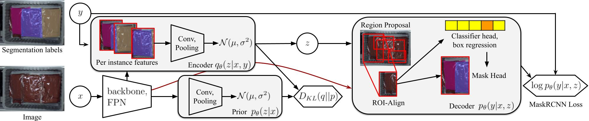
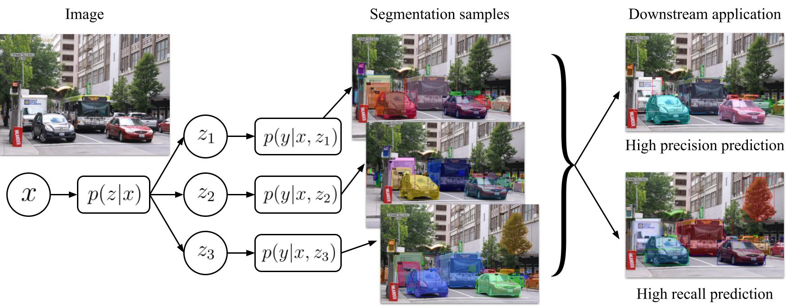

# Distributional Instance Segmentation: Modeling Uncertainty and High Confidence Predictions with Latent-MaskRCNN
### [Project Page](https://segm.yuxuanliu.com) | [Paper]() | [Dataset](https://www.dropbox.com/s/ujrqxfw2zu1xbyg/Apparel5kDataset.zip?dl=0)

Pytorch implementation of our autoregressive model formulation for 3D bounding-box estimation & detection. 

[Distributional Instance Segmentation: Modeling Uncertainty and High Confidence Predictions with Latent-MaskRCNN](https://segm.yuxuanliu.com)  
 [YuXuan Liu](https://yuxuanliu.com/)1,2,
 [Nikhil Mishra](https://nikhilmishra000.github.io/)1,2,
 [Pieter Abbeel](https://people.eecs.berkeley.edu/~pabbeel/)1,2,
 [Xi Chen](https://peterchen.us/)1  
 1Covariant.ai, 2UC Berkeley

  

### Latent-MaskRCNN

This code is based on [Detectron2](https://github.com/facebookresearch/Detectron2)

Installation see [INSTALL.md](INSTALL.md)

For our Latent-MaskRCNN models see [configs/latent](configs/latent).

The MaskRCNN decoder and confidence mask implementation is in [detectron2/modeling/meta_arch/rcnn.py](detectron2/modeling/meta_arch/rcnn.py)

Our encoder and prior models are in [detectron2/modeling/latent.py](detectron2/modeling/latent.py).

### License 
Shield: [![CC BY-NC-SA 4.0][cc-by-nc-sa-shield]][cc-by-nc-sa]

This work, including the paper, code, weights, and dataset, is licensed under a
[Creative Commons Attribution-NonCommercial-ShareAlike 4.0 International License][cc-by-nc-sa].

[![CC BY-NC-SA 4.0][cc-by-nc-sa-image]][cc-by-nc-sa]

[cc-by-nc-sa]: http://creativecommons.org/licenses/by-nc-sa/4.0/
[cc-by-nc-sa-image]: https://licensebuttons.net/l/by-nc-sa/4.0/88x31.png
[cc-by-nc-sa-shield]: https://img.shields.io/badge/License-CC%20BY--NC--SA%204.0-lightgrey.svg

